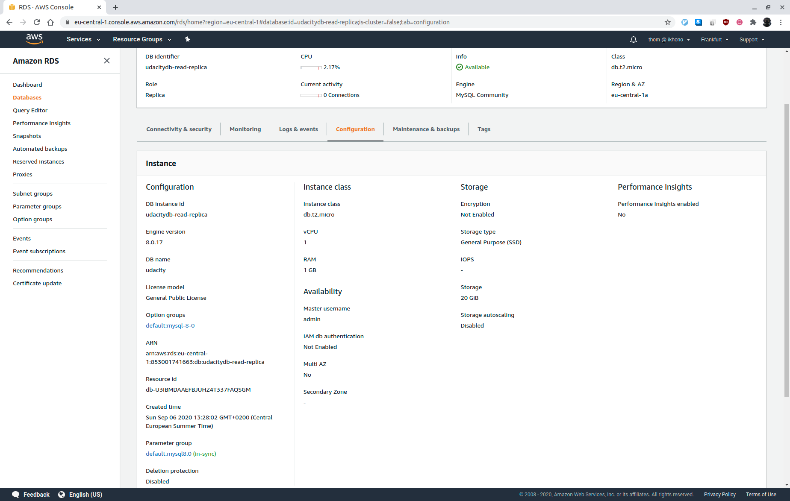

# Udacity AWS Cloud Architect Program - Project 1: Recoverability in AWS

This project creates highly available solutions to common use cases:

- Multi-Availability Zone, Multi-Region database showing how to use it in multiple geographically separate AWS regions
- Versioned website hosting solution so that any data destruction and accidents can be quickly and easily undone

## Infrastructure setup

Use the AWS CloudFormation YAML file `cfn/vpc.yaml` following the below steps to create the required infrastructure:

1. Go to "Services: CloudFormation"
2. Create stack "With new resources (standard)"

 _Create VPC_

1. Template is ready
2. Upload a template file
3. Click "Choose file" button
4. Select provided YAML file
5. Next
6. Fill in Stack name
7. Name the VPC
8. Update the CIDR blocks
9. Click Next
10. Click Next again
11. Click Create stack
12. Wait for the stack to build out. Refresh until status becomes "CREATE_COMPLETE"
13. Observe the "Outputs" tab for the created IDs. These will be used later.

 _Primary VPC_

 _Secondary VPC_

## Part 1: Data Durability And Recovery

### Highly durable RDS Database

1. Create a new RDS Subnet group in the active and standby region.

 _Primary VPC subnets_

 _Primary subnet routing_

 _Primary RDS subnet group_

 _Secondary VPC subnets_

 _Secondary subnet routing_

 _Secondary RDS subnet group_

1. Create a new MySQL, multi-AZ database in the active region:

  - Choose "Standard Create"
  - Must be a MySQL database
  - Choose the "Production" template
  - Select "burstable" instance class
  - Use "General Purpose" storage
  - Select Multi-AZ database
  - Must be in the newly created VPC in the newly created subnet group
  - Must have only the "UDARR-Database" security group
  - Must have an initial database called "udacity"
  - Must have automatic backups enabled for a period of 7 days.

 _Primary DB configuration_

1. Create a read replica database in the standby region. This database has the same requirements as the database in the active region.

 _Secondary DB configuration_

### Availability Estimate

Recover Time Objective (RTO) is the maximum time the platform or service can be unavailable.

Recovery Point Objective (RPO) is the maximum amount of time that the system can lose data for. RPO is not tied to whether the system is available, it is a measure of the window of time that data may be lost in.

#### Minimum RTO for a single AZ outage

See the [AWS documentation](https://docs.aws.amazon.com/AmazonRDS/latest/UserGuide/Concepts.MultiAZ.html) for details on high availability (Multi-AZ). In the event of a planned or unplanned outage of your DB instance, Amazon RDS automatically switches to a standby replica in another Availability Zone if you have enabled Multi-AZ. The time it takes for the failover to complete depends on the database activity and other conditions at the time the primary DB instance became unavailable. Failover times are typically 60–120 seconds. However, large transactions or a lengthy recovery process can increase failover time. When the failover is complete, it can take additional time for the RDS console to reflect the new Availability Zone.

#### Minimum RTO for a single region outage

If there is a single region outage, the read replicate in the secondary region needs to be manually promoted in the AWS console. The replication between the master and read replica is asynchronous. The promotion of the read replica takes a few minuts to complete and the endpoint of the read replica is different from the master, so the replica promotion requires also a change in all the applications that use the database. We can assume an RTO of about 10 minutes.

#### Minimum RPO for a single AZ outage

If we assume that the replication is in sync at the time of the outage, the RPO is zero. As failover times from the primary to the standby instance are typically 60-120 seconds, it is however possible that data can be lost during the switch.

#### Minimum RPO for a single region outage

If we again assume that the replication is in sync at the time of the outage, the RPO is zero. As we have to manually promote the replica and change the database endpoint configuration in all the applications that use the database, it is however possible that data can be lost during the switch (about 10 minutes).

### Demonstrate normal usage

```
[ec2-user@ip-10-1-10-129 ~]$ mysql -h udacitydb.cmqdf4jpgc2h.us-east-1.rds.amazonaws.com -D udacity -u admin -p
Enter password: 
Welcome to the MariaDB monitor.  Commands end with ; or \g.
Your MySQL connection id is 38
Server version: 8.0.17 Source distribution

Copyright (c) 2000, 2018, Oracle, MariaDB Corporation Ab and others.

Type 'help;' or '\h' for help. Type '\c' to clear the current input statement.

MySQL [udacity]> CREATE TABLE IF NOT EXISTS users (
    -> id INT AUTO_INCREMENT PRIMARY KEY,
    -> nick_name VARCHAR(255) NOT NULL,
    -> first_name VARCHAR(255),
    -> last_name VARCHAR(255),
    -> email VARCHAR(255) NOT NULL,
    -> about TEXT,
    -> admin TINYINT(1) NOT NULL DEFAULT 0,
    -> created_at TIMESTAMP DEFAULT CURRENT_TIMESTAMP
    -> ) ENGINE=INNODB;
Query OK, 0 rows affected, 1 warning (0.06 sec)

MySQL [udacity]> INSERT INTO `users`(`nick_name`, `first_name`, `last_name`, `email`, `about`, `admin`)
    -> VALUE('zaphod', 'Zaphod', 'Beeblebrox', 'zaphod@beeblebrox.net', 'President Zaphod Beeblebrox I', 1);
Query OK, 1 row affected (0.01 sec)

MySQL [udacity]> SELECT * FROM users;
+----+-----------+------------+------------+-----------------------+-------------------------------+-------+---------------------+
| id | nick_name | first_name | last_name  | email                 | about                         | admin | created_at          |
+----+-----------+------------+------------+-----------------------+-------------------------------+-------+---------------------+
|  1 | zaphod    | Zaphod     | Beeblebrox | zaphod@beeblebrox.net | President Zaphod Beeblebrox I |     1 | 2020-09-06 12:50:52 |
+----+-----------+------------+------------+-----------------------+-------------------------------+-------+---------------------+
1 row in set (0.00 sec)

MySQL [udacity]>
```

### Monitor database

1. Observe the "DB Connections" to the database

 _Connections_

1. Observe the "Replication" configuration

 _Replication_

## Part 2: TBD

TBD

## Part 3: TBD

TBD

## Requirements

Graded according to the [Project Rubric](https://review.udacity.com/#!/rubrics/2811/view).

## License

- **[MIT license](http://opensource.org/licenses/mit-license.php)**
- Copyright 2020 © [Thomas Weibel](https://github.com/thom).
